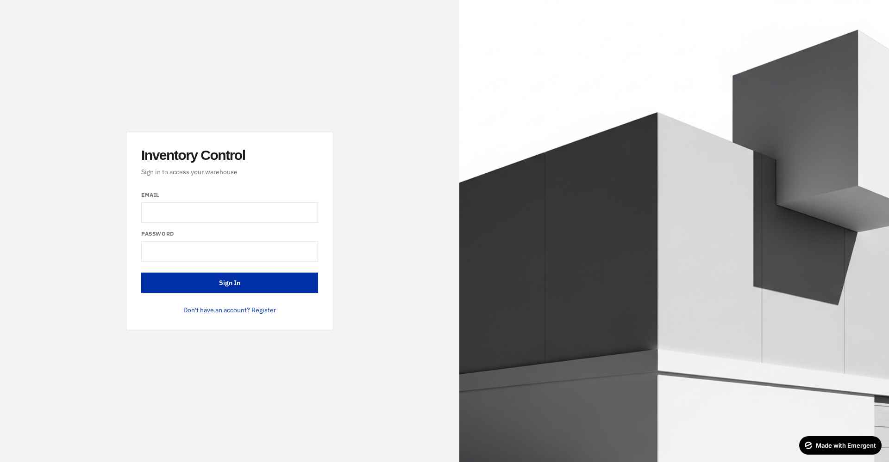
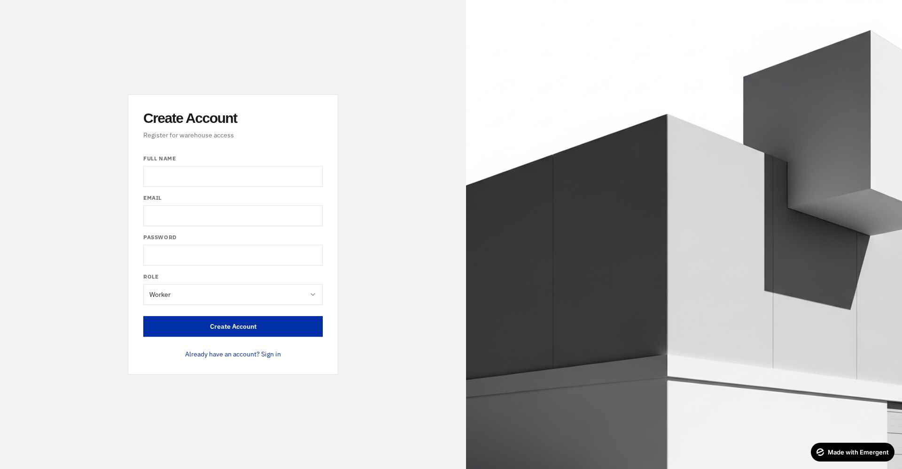
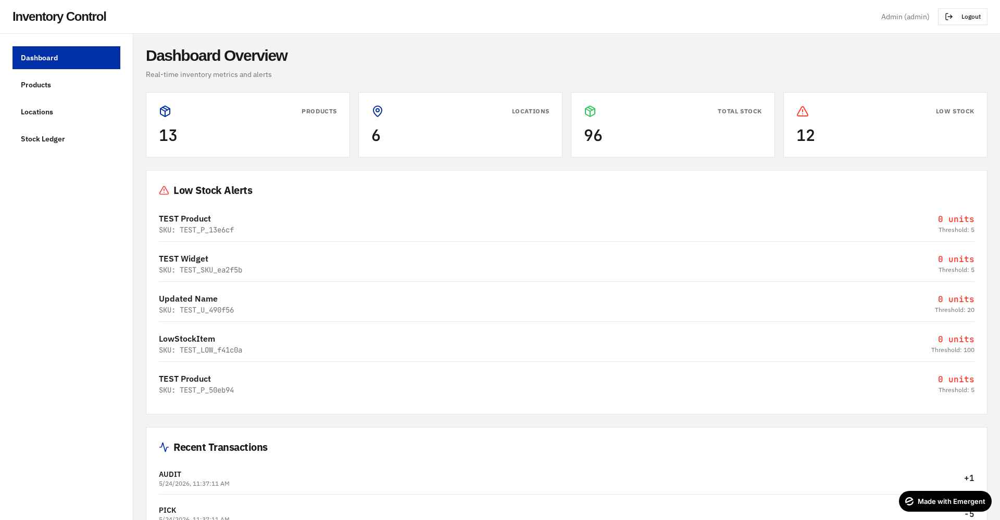
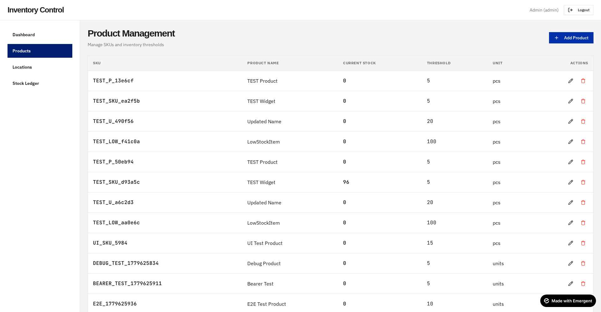
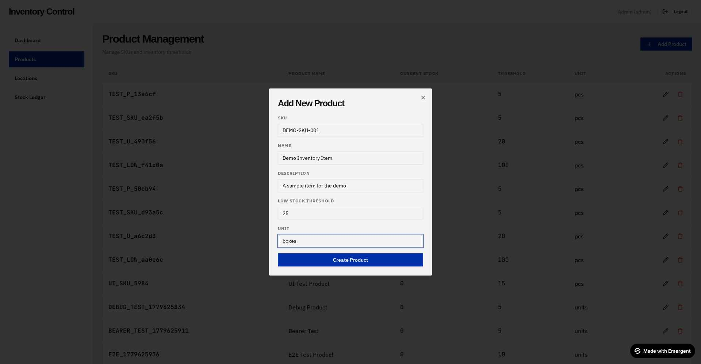
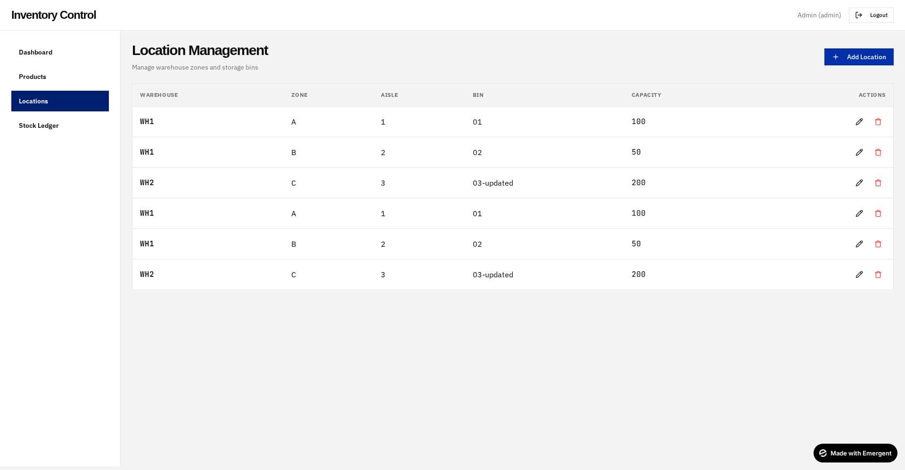
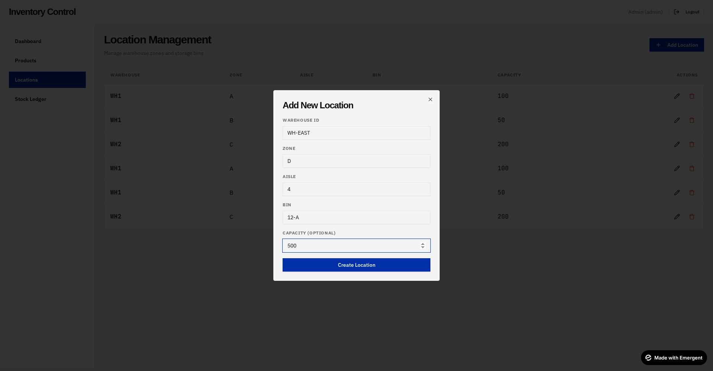
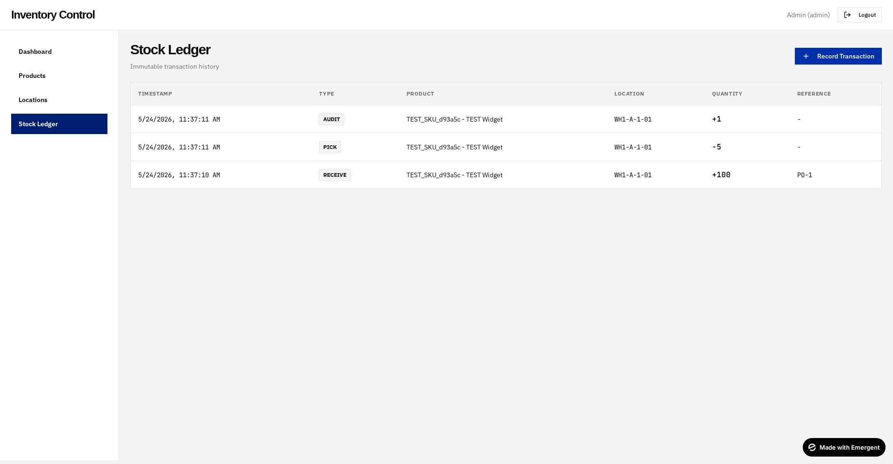
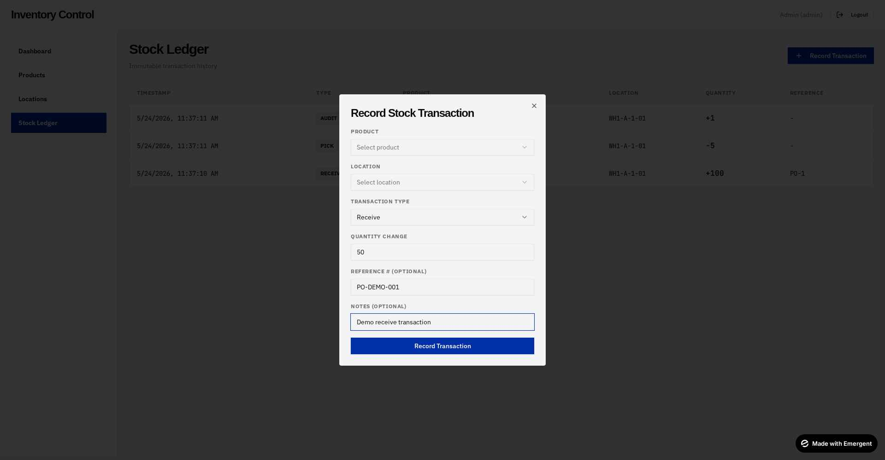
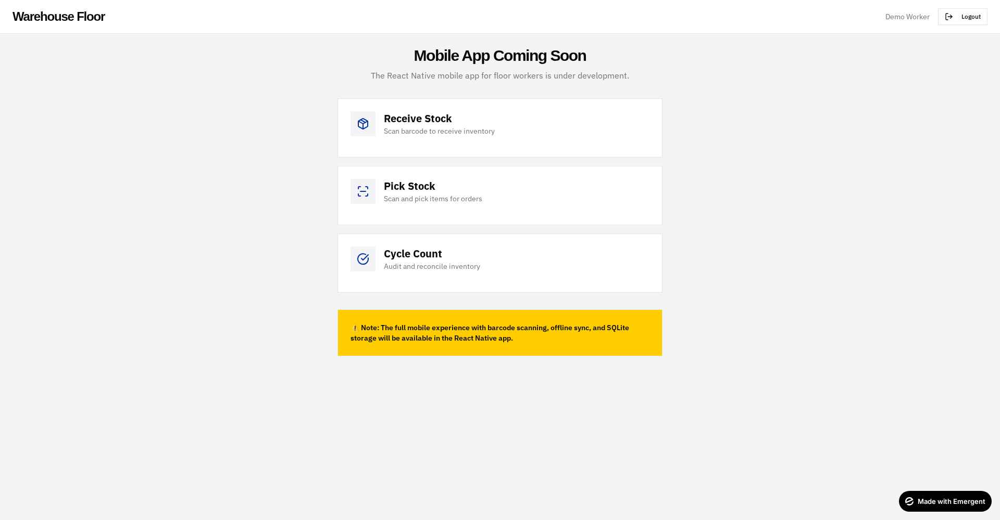

# Inventory Management Platform — Complete UI Walkthrough

> **Application**: Full-stack inventory management platform with immutable StockLedger architecture, role-based access control (Admin/Worker), and mobile-ready API.
>
> **Tech Stack**: FastAPI · React · MongoDB · Tailwind · shadcn/ui
>
> **Admin Login**: `admin@inventory.com` / `Admin@123`

---

## Table of Contents
1. [Login Page](#1-login-page)
2. [Register Page](#2-register-page)
3. [Admin Dashboard](#3-admin-dashboard)
4. [Product Management](#4-product-management)
5. [Add Product Dialog](#5-add-product-dialog)
6. [Location Management](#6-location-management)
7. [Add Location Dialog](#7-add-location-dialog)
8. [Stock Ledger](#8-stock-ledger)
9. [Record Transaction Dialog](#9-record-transaction-dialog)
10. [Worker Page](#10-worker-page)
11. [Architecture Highlights](#architecture-highlights)

---

## 1. Login Page
**Route**: `/login`



### Purpose
Authenticated entry point for both Admin and Worker users.

### Key Elements
- **Left panel**: Email + Password form with "Sign In" CTA and a link to Register.
- **Right panel**: Architectural warehouse hero image — minimalist Swiss design.
- **Branding**: "Inventory Control" displayed in Cabinet Grotesk (heavy, tight-tracking).

### Behavior
- Backend returns the user's role on successful login.
- Role-based routing: `admin` → `/dashboard`, `worker` → `/worker`.
- JWT token is stored in `localStorage` + httpOnly cookie (dual-auth strategy for cross-origin scenarios).

### Test Credentials
```
admin@inventory.com / Admin@123
```

---

## 2. Register Page
**Route**: `/register`



### Purpose
Self-service account creation.

### Key Elements
- **Fields**: Full Name, Email, Password, **Role** dropdown.
- **Role options**: `Worker` (default) or `Admin`.
- Cross-link "Already have an account? Sign in" → routes to `/login`.

### Behavior
- POST `/api/auth/register` → returns user object + access token in body.
- Auto-redirects based on role after successful registration.
- Email uniqueness is enforced server-side via MongoDB unique index.

> **⚠️ Production note**: Admin role selection should be server-restricted in production (current self-serve admin signup is for demo convenience).

---

## 3. Admin Dashboard
**Route**: `/dashboard` (admin only)



### Purpose
Real-time operational overview — stat cards, low-stock alerts, and a transaction feed.

### Key Sections

#### A. Top Stat Cards (4 KPIs)
| Card | Description | Source |
|---|---|---|
| **Products** | Total SKUs in catalog | `db.products.count_documents({})` |
| **Locations** | Total warehouse bins | `db.locations.count_documents({})` |
| **Total Stock** | Sum of all ledger entries | Aggregation: `SUM(stock_ledger.quantity_change)` |
| **Low Stock** | Products below threshold | Per-product `<` comparison on aggregated stock |

#### B. Low Stock Alerts
Lists every product whose current stock falls below its configured `low_stock_threshold`. Each row shows:
- Product name + SKU (JetBrains Mono)
- Current units (red, bold)
- Threshold value

#### C. Recent Transactions
Chronological feed of transaction events (`AUDIT`, `PICK`, `RECEIVE`, `TRANSFER`) with signed quantity deltas (`+1`, `-5`, `+100`) and timestamps.

#### D. Left Sidebar Navigation
- **Dashboard** (active — highlighted blue `#002FA7`)
- Products
- Locations
- Stock Ledger

---

## 4. Product Management
**Route**: `/products` (admin only)



### Purpose
CRUD interface for the SKU master data.

### Table Columns
| Column | Notes |
|---|---|
| **SKU** | Unique identifier — rendered in mono font |
| **Product Name** | Human-readable label |
| **Current Stock** | Computed live from `stock_ledger` (never stored on product!) |
| **Threshold** | Configurable low-stock alert level |
| **Unit** | e.g., `units`, `pcs`, `boxes` |
| **Actions** | ✏️ Edit · 🗑️ Delete |

### Key Behaviors
- **Add Product** button (top-right, primary blue) opens the create dialog.
- Each row's `Current Stock` is the result of a MongoDB aggregation pipeline that sums `quantity_change` from `stock_ledger` for that `product_id`.
- Edit and Delete actions are admin-only (RBAC enforced at API level).

---

## 5. Add Product Dialog



### Purpose
Create a new SKU with a configurable low-stock threshold.

### Fields
| Field | Required | Description |
|---|---|---|
| **SKU** | ✓ | Unique product code |
| **Name** | ✓ | Display name |
| **Description** | – | Optional details |
| **Low Stock Threshold** | ✓ | Per-product alert level (configurable per the user requirement) |
| **Unit** | ✓ | Unit of measure |

### Behavior
- Submitting saves the product and immediately recalculates dashboard stats.
- SKU uniqueness is enforced by a MongoDB unique index.

---

## 6. Location Management
**Route**: `/locations` (admin only)



### Purpose
Manage warehouse zones, aisles, and storage bins.

### Hierarchy Model
Locations follow a 4-part structure that supports future pick-path optimization:

```
Warehouse → Zone → Aisle → Bin
   WH1   →   A  →   1   → 01
```

### Table Columns
- **Warehouse** — facility identifier (mono)
- **Zone** — high-level area (A, B, C…)
- **Aisle** — numeric aisle within zone
- **Bin** — specific shelf/slot
- **Capacity** — optional metadata (max units the bin holds)
- **Actions** — Edit / Delete

---

## 7. Add Location Dialog



### Purpose
Register a new storage location.

### Fields
| Field | Required | Notes |
|---|---|---|
| **Warehouse ID** | ✓ | e.g., `WH-EAST`, `WH1` |
| **Zone** | ✓ | e.g., `A`, `B`, `D` |
| **Aisle** | ✓ | e.g., `1`, `4` |
| **Bin** | ✓ | e.g., `01`, `12-A` |
| **Capacity** | – | Optional max-units integer |

---

## 8. Stock Ledger
**Route**: `/stock-ledger` (admin only)



### Purpose
**Immutable transaction history** — the single source of truth for all inventory movements.

### Architecture Note
This is the **heart of the system**. Unlike traditional inventory systems that mutate a `quantity` field, every stock change is appended as a new ledger row:
- **No UPDATE operations**
- **No DELETE operations**
- Current stock is always derived: `current_stock = SUM(quantity_change WHERE product_id = X)`

This guarantees:
- Full audit trail
- Time-travel queries (stock at any past timestamp)
- Reconciliation simplicity
- Conflict-free mobile offline sync (transactions are append-only)

### Table Columns
| Column | Description |
|---|---|
| **Timestamp** | Server-side `datetime.now(timezone.utc)` |
| **Type** | Badge: `RECEIVE` · `PICK` · `TRANSFER` · `AUDIT` |
| **Product** | SKU + product name |
| **Location** | Hierarchical: `WH1-A-1-01` |
| **Quantity** | Signed delta (`+100`, `-5`, `+1`) |
| **Reference** | Optional external ID (PO#, order#, etc.) |

### Transaction Types
| Type | Sign | Use Case |
|---|---|---|
| `RECEIVE` | `+` | Stock arrives from supplier |
| `PICK` | `-` | Stock leaves for an order |
| `TRANSFER` | `±` | Move between locations (two paired entries) |
| `AUDIT` | `±` | Physical count reconciliation adjustment |

---

## 9. Record Transaction Dialog



### Purpose
Manually record a stock movement (also used by the mobile app via `/api/sync/push`).

### Fields
| Field | Required | Description |
|---|---|---|
| **Product** | ✓ | Searchable select of all SKUs |
| **Location** | ✓ | Searchable select of all bins |
| **Transaction Type** | ✓ | Receive / Pick / Transfer / Audit |
| **Quantity Change** | ✓ | Signed integer (positive for receive, negative for pick) |
| **Reference #** | – | Optional — links to PO/order/audit ID |
| **Notes** | – | Free-form context |

### Behavior
- POST `/api/stock/transaction` → inserts a single new row in `stock_ledger`
- Dashboard stats auto-recompute on next refresh
- Linked to authenticated user (recorded in `user_id` field)

---

## 10. Worker Page
**Route**: `/worker` (worker role)



### Purpose
Landing page for warehouse floor workers — interim placeholder until the React Native mobile app ships.

### Key Elements

#### Three Feature Cards
Each card represents a planned mobile flow:
- **Receive Stock** — Scan barcode to receive inventory
- **Pick Stock** — Scan and pick items for orders
- **Cycle Count** — Audit and reconcile inventory

#### Warning Banner (yellow)
Communicates that the full mobile experience (barcode scanning, offline-first SQLite sync, large tap targets) is coming in the React Native build documented at `/app/mobile/`.

### Header Difference
Note the header reads **"Warehouse Floor"** instead of "Inventory Control" — visual cue that this is a worker context, not an admin one.

---

## Architecture Highlights

### Visible in the UI
| Feature | Where to spot it |
|---|---|
| **Immutable StockLedger** | Stock Ledger page — no edit/delete buttons; `Current Stock` on Products page is always derived from aggregation |
| **Role-Based Access Control** | Admin sees Dashboard/Products/Locations/Ledger sidebar; Worker is routed to the Warehouse Floor page only |
| **Configurable thresholds** | Add Product → "Low Stock Threshold" field per SKU |
| **Real-time aggregation** | Dashboard `Total Stock` is `SUM(stock_ledger.quantity_change)` computed on every request |
| **Swiss design system** | Cabinet Grotesk headings · IBM Plex Sans body · JetBrains Mono for SKUs/quantities · monochrome surfaces with single blue (`#002FA7`) + red (`#FF3B30`) accents · no shadows, sharp 1px borders |

### Backend API Endpoints
| Endpoint | Method | Auth | Purpose |
|---|---|---|---|
| `/api/auth/register` | POST | – | Create user |
| `/api/auth/login` | POST | – | Authenticate |
| `/api/auth/logout` | POST | ✓ | Clear session |
| `/api/auth/me` | GET | ✓ | Current user |
| `/api/products` | GET / POST | ✓ / admin | List / create |
| `/api/products/{id}` | PUT / DELETE | admin | Update / delete |
| `/api/locations` | GET / POST | ✓ / admin | List / create |
| `/api/locations/{id}` | PUT / DELETE | admin | Update / delete |
| `/api/stock/transaction` | POST | ✓ | Insert ledger row |
| `/api/stock/ledger` | GET | ✓ | List transactions |
| `/api/stock/product/{id}` | GET | ✓ | Per-product history |
| `/api/dashboard/stats` | GET | ✓ | KPI aggregations |
| `/api/dashboard/low-stock` | GET | ✓ | Low-stock alerts |
| `/api/sync/push` | POST | ✓ | Mobile bulk upload |
| `/api/sync/pull` | GET | ✓ | Mobile fetch updates |

### Data Model
```
users           { _id, email, password_hash, name, role, created_at }
products        { id, sku, name, description, low_stock_threshold, unit, created_at }
locations       { id, warehouse_id, zone, aisle, bin, capacity, created_at }
stock_ledger    { id, product_id, location_id, user_id, transaction_type,
                  quantity_change, reference_number, notes, timestamp }
```

---

## Quick Demo Script (for 5-min video)

| Time | Section | What to show |
|---|---|---|
| 0:00 – 0:30 | **Intro** | Title card + "Inventory management with immutable ledger architecture" |
| 0:30 – 1:00 | **Login** | Show Swiss design login page → sign in as admin |
| 1:00 – 1:45 | **Dashboard** | Walk through 4 KPI cards, hover over low-stock alerts, scroll to recent transactions |
| 1:45 – 2:30 | **Products** | Show table → click Add Product → demonstrate threshold field → save → see it appear |
| 2:30 – 3:00 | **Locations** | Show hierarchy (Warehouse→Zone→Aisle→Bin) → add a location |
| 3:00 – 3:45 | **Stock Ledger** | Highlight "immutable" badge — no edit/delete → Record Transaction → RECEIVE 100 units → show ledger row appear + Dashboard stats update |
| 3:45 – 4:15 | **Worker view** | Logout → register as worker → land on Warehouse Floor page → explain mobile roadmap |
| 4:15 – 4:45 | **API tour** | Quick Postman/curl showing same flows via API (admin authorization required for product/location CRUD) |
| 4:45 – 5:00 | **Outro** | Tech stack recap (FastAPI + React + MongoDB) + "next: React Native mobile with barcode scanning + SQLite offline sync" |
